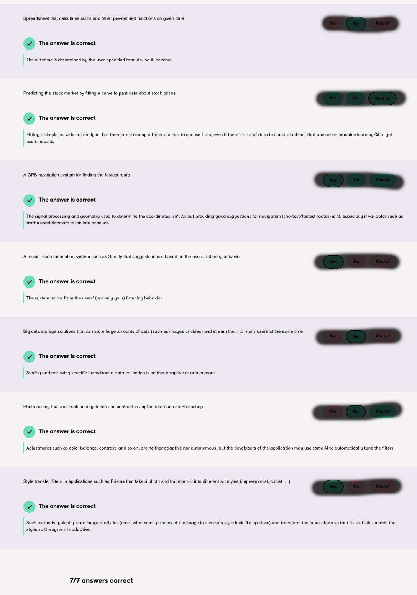

<h1>Instructions for Ch. 1 and 2 Exercises</h1>

Take screen-shots of each the three completed exercises. You can Zoom out in your browser so all the graded answers for one exercise fit in one  screen-shot like the example below:

