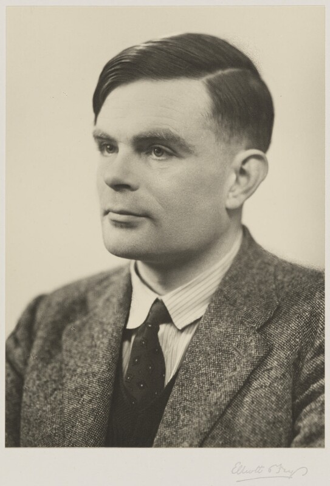
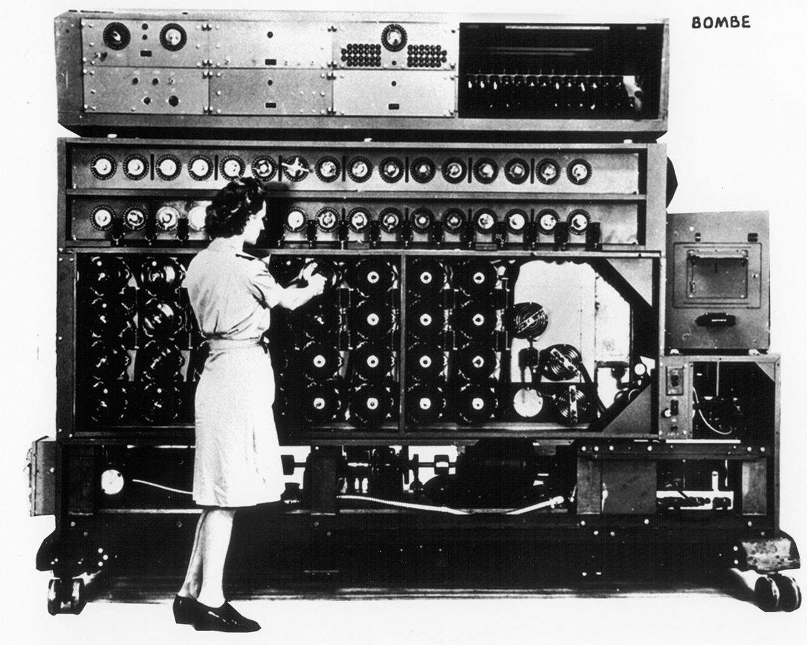
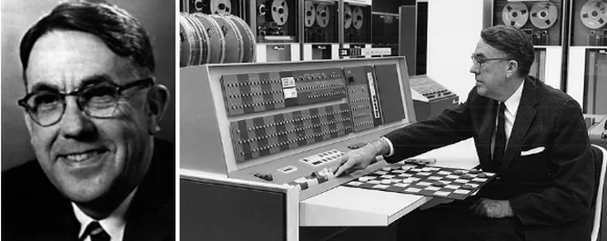

<h1>History of AI Part 1</h1>

**CS123, Intro to AI**

| Topics                                                |                                              |
| ----------------------------------------------------- | -------------------------------------------- |
| Overview of AI                                        | Neural networks and deep learning            |
| <mark>History of GOFAI</mark> AI Problem Solving | Generative AI + Prompt engineering           |
| Machine Learning                                      | Custom chatbot creation                      |
| Midterm                                               | Social and ethical issues of AI   Final |

<h2>Table of Contents</h2>

[TOC]

# Introduction

## What's Happening this Week

- Exercises for Ch. 2, "Problem Solving" in *Elements of AI*
- Lecture Q and A forum for online students
- Lecture quiz for everyone.

Next week the first project will be due.

# Key Events in the History of AI

This is part 1 of the history of AI. It starts with the first computer programmer in 1843 and continues on up through the development of symbolic AI (also known as Good Old Fashioned AI) ending in 1997 with a computer beating the world chess champion.

## Lady Ada Lovelace, the First Computer Programmer

*Margaret Sarah Carpenter's portrait of Lady Ada Lovelace*

1843: Lady Ada Lovelace, often recognized as the world’s first computer programmer, foresaw some aspects of artificial intelligence. In her “Translator’s Note G,” (her translation from French of lectures by Charles Babbage) dubbed by Alan Turing as “Lady Lovelace’s Objection,” She envisioned machines capable of performing complex tasks beyond mere calculation, foreshadowing the capabilities of modern AI systems. However, she maintained that these machines would not have the ability to understand or originate anything. They would only be able to do what they were programmed to do.

## Alan Turing, the Imitation Game & Early Computers

*by Elliott & Fry, vintage bromide print on photographer's mount, 29 March 1951, NPG x27079, © National Portrait Gallery, London, used by permission under a cc by-nc-nd/3.0 license*.

1936: Turing published a paper tilted "On Computable Numbers, with an Application to the Entscheidungsproblem[^1]". In this paper he devised a theoretical design for computing machine[^2] which is now call a *Turing machine*[^3]. Almost all modern computers are Turing machines. 

1939: The British military put the first Bombe machine into operation. This computer and its successors were in part based on the theoretical work done by Turing and were used to break the German Enigma code. Since it was not generally programable, it was not considered *Turing complete*.

1950: Alan Turing published a paper titled “Computing Machinery and Intelligence,” questioning whether or not machines could manifest human intelligence and proposed the "imitation game", aka the *Turing test*.

1954: Alan Turing tragically committed suicide at the age of 42 after being prosecuted for being gay.

## ENIAC and the First Computers

1946: The ENIAC (Electronic Numerical Integrator and Computer) - was completed at the University of Pensilvania by a team led by John Mauchly and J. Presper Eckert. It is considered by many[^4] to be the first *Turing complete* machine. It used over 17,000 vacuum tubes which required a lot space and power and created a lot of heat.

*Courtesy of the Moore School of Electrical Engineering, University of Pennsylvania*

**Why this matters**: The significance of the development of a computer that could be re-programed for different tasks was a prerequisite for developing AI software.

### Transistorized Computers

1962: The IBM 7094 was the first transistorized mainframe computer. It was a large, powerful computer using over 12,000 transistors and was designed for scientific and engineering applications.

1967: The IBM 360 Model 95 was the first mainframe computer built using integrated circuits (ICs). It had over 12,000 ICs, with each contained many transistors. The total number of transistors was over 100,000. It had a clock speed of 1.9 MHz and 256 KB of memory. It was considered to be extremely high performance in its day and was used for a variety of applications, including business processing, scientific simulations, and data processing.

## Claude Shannon and Game Theory

Claude Shannon, and electrical engineer and mathematician, is often referred to as the "father of the modern digital computer".

1950: He published "Programming a Computer for Playing Chess". In which he described a computer program for playing chess which used a game tree and the minimax algorithm. It laid the foundation for the development of AI game-playing programs and is still influential in the field of artificial intelligence and game theory.

## Arthur Samuel and Machine Learning

1952: [Arthur Samuel](https://en.wikipedia.org/wiki/Arthur_Samuel_(computer_scientist)) created a checkers-playing computer program that could determine the probability of winning a game. It was the first program to <u>learn</u> how to <u>autonomously</u> play a game. This was one of the first *reinforcement learning* programs. 

*Arthur Samuel playing checkers with IBM's first actual computer, the 701.*

## John McCarthy and the Dartmouth Workshop

A mathematics professor at Dartmouth College who coined the term *Artificial Intelligence*.

1956: Dartmouth Summer Research Project on Artificial Intelligence. 

- The workshop was based on the idea that: "Every aspect of learning or any other feature of  intelligence can in principle be so precisely described that a machine can be made to simulate it."
- This workshop is considered the founding event of AI research as a distinct field of study.

## Newell and Simon Develop the General Problem Solver

1957: The General Problem Solver (GPS), an early AI program developed by Allen Newell and Herbert A. Simon at the Rand Corporation, was intended to be a universal problem solver.

GPS used a technique called means-ends analysis. This involved identifying differences between the current state and the goal state, then finding and applying operators that would reduce these differences. In other words, it created a *state-space* and used transitions to move from one state to another.

It’s worth noting that while GPS was groundbreaking, it was limited by the computational power of the time and the complexity of many real-world problems. Nevertheless, GPS laid the foundation for many future developments in AI including the Soar archtecture which was developed by Newell and others and is still used for commercial applications and is avialable as open source software.

## Marvin Minsky, ANNs and the MIT AI Lab

Marvin Lee Minsky was an American cognitive and computer scientist whois often referred to as one of the fathers of AI. He defined AI as “the science of making machines do things that would require intelligence if done by men”. 

1951: While studying mathematics at Princeton, Minsky built the first learning machine, an artificial neural network built from vacuum tubes called the Stochastic Neural Analog Reinforcement Calculator, or SNARC.

1959: He co-founded the Massachusetts Institute of Technology's AI laboratory.

## Frank Rosenblatt and the Perceptron

1957: The perceptron, designed by by Frank Rosenblatt, was based on the McCulloch–Pitts mathematical model of a neuron (1943). It was a system for supervised machine learning for binary classifiers. The first Perceptron, known as the Mark I, was a combination of software that ran on an IBM 7094 and custom hardware consisting of transisterized circuits. It was built at the Cornell Aeronautical Laboratory which was affiliated with Cornell University in New York. 

This was an early example of connectionism which was a competing approach to symbolism the dominant approach to AI at the time.

The perceptron and connectionism were notably criticized by Marvin Minsky and Seymour Papert. They mounted their critique in their 1969 book titled *Perceptrons*. In this book, they argued that the perceptron had severe limitations. Their critique contributed to a decrease in enthusiasm and funding for perceptron research, marking the beginning of what is known as the "AI winter".

## Widrow and Hoff Develop ADALINE

1962: Bernard Widrow and Marcian Hoff of Stanford developed models called “ADALINE” and “MADALINE”. ADALINE was developed to recognize binary patterns so that if it was reading streaming bits from a phone line, it could predict the next bit. MADALINE was the first neural network applied to a real-world problem, using an adaptive filter that eliminates echoes on phone lines

## Joseph Weizenbaum and Eliza

1966: Eliza program, a Rogerian therapist chatbot. You can try a modern version of Eliza [on this web site](https://psych.fullerton.edu/mbirnbaum/psych101/eliza.htm).

**Why this matters:**  ELIZA was one of the first programs to do Natural Language Processing (NLP) and to simulate conversation between a human and a machine. It used pattern matching and simple rules to respond to user input, creating the illusion of understanding. 

## AI winter

> In 1974, the applied mathematician Sir James Lighthill published a critical report on academic AI research, claiming that researchers had essentially over-promised and under-delivered when it came to the potential intelligence of machines. His condemnation resulted in stark funding cuts. 
>
> The period between the late 1970s and early 1990s signaled an “AI winter”—a term first used in 1984—that referred to the gap between AI expectations and the technology’s shortcomings.  
> (From The History of AI: A Timeline of Artificial Intelligence)

## Deep Blue Beats a World Champion Chess Player

1997: IBM's Deep Blue was the first computer to defeat a reigning world chess champion, Garry Kasparov. Deep Blue's AI methodologies were primarily based on brute force symbolic computing power using techniques like preprogrammed chess rules, game trees and state-space searches. It did not use machine learning or neural networks. 

It used 32 processors to perform a set of coordinated, high-speed computations in parallel. The system was capable of evaluating 200 million chess positions Per Second, achieving a processing speed of over 11 Gigaflops (11 billion Floating Point Operations per Second). 

# Reference

[Alan Turing and the Birth of the Modern Computer](https://www.cbsnews.com/pictures/alan-turing-and-the-birth-of-modern-computing/3/)&mdash;CBS News

[The Games that helped AI Evolve](https://www.ibm.com/history/early-games?mhsrc=ibmsearch_a&mhq=arthur%20samuel%20checkers)&mdash;IBM

[Soar (Cognitive Archigtecture)](https://en.wikipedia.org/wiki/Soar_(cognitive_architecture))&mdash;Wikipedia

[The History of AI: A Timeline of Artificial Intelligence](https://www.coursera.org/articles/history-of-ai)&mdash;Coursera

[The Quest for Artificial Intelligence: A History of Ideas and Achievements](http://ai.stanford.edu/%7Enilsson/QAI/qai.pdf)&mdash;Nils J. Nilsson, Cambridge University Press, 2010.

[Timeline of AI](https://www.theainavigator.com/ai-timeline)&mdash;an interactive timeline of the history of AI

[^1]:The Entscheidungsproblem, which translates to "decision problem" in German, was a mathematical question proposed by David Hilbert in the early 1900s. It asked: "Is there a mechanical procedure (algorithm) that can decide whether any given statement in mathematics is true or false?"
[^2]: A Turing machine consists of three key parts: 1) An infinitely long tape. This tape is divided into squares, each holding a symbol. The machine can read, write, and move this tape to access information. 2) A read/write head: This head scans the current symbol on the tape and can modify it based on the machine's rules. 3) A state table: This table defines the machine's behavior. It tells the machine what to do (change state, write a symbol, move the tape) based on the current symbol it reads and the machine's internal state.
[^3]: No one has actually built a Turing machine, since  his theoretical machine had infinite memory. Instead, modern computers that are based on his theoretical design are considered *Turing complete* even if they have finite memory (RAM and disk storage).
[^4]: The Colossus Mark 1 - operational by early 1944 was a British codebreaking machine which may have been the first Turing complete machine, but its design details were kept secret.

---

 Intro to AI lecture notes by [Brian Bird](https://profbird.dev), written in <time>2024</time>, are licensed under a [Creative Commons Attribution-ShareAlike 4.0 International License](http://creativecommons.org/licenses/by-sa/4.0/). 

Note: GPT-4 and GPT-4o were used to draft parts of these notes.
