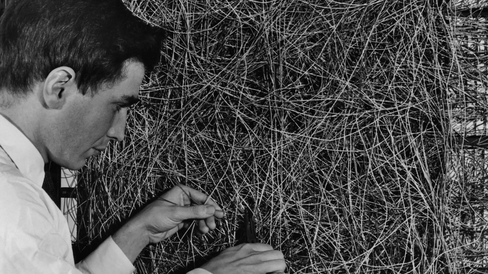
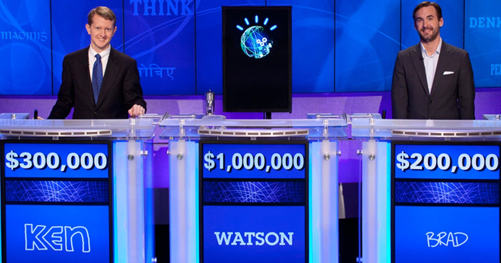
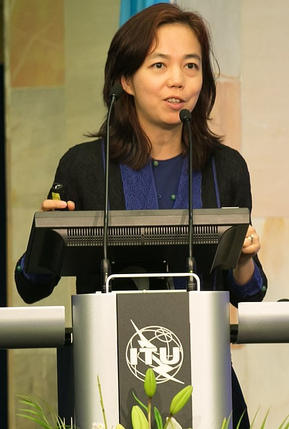
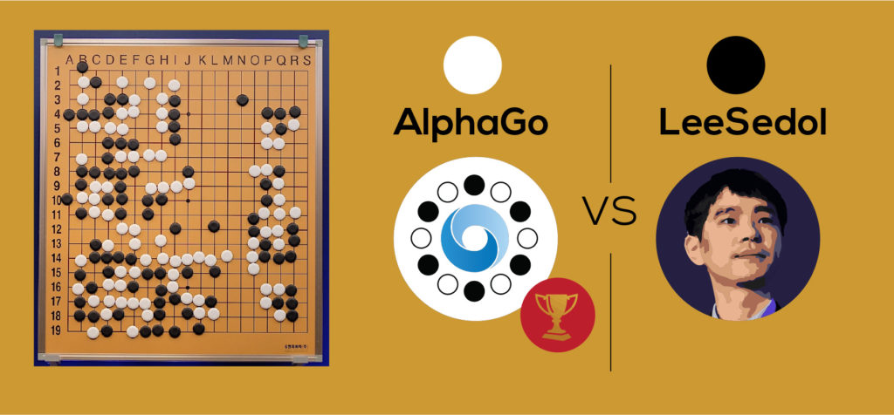

<h1>History of AI Part 2</h1>

**CS123, Intro to AI**

| Topics                                                       |                                              |
| ------------------------------------------------------------ | -------------------------------------------- |
| Overview of AI                                               | Neural networks and deep learning            |
| AI Problem Solving Revisited Machine Learning&mdash;Part 1 Applications of AI | Generative AI + Prompt engineering           |
| Machine Learning&mdash;Part 2                                | Custom chatbot creation                      |
| <mark>History of AI + Midterm</mark>                         | Social and ethical issues of AI   Final |

<h2>Table of Contents</h2>

[TOC]

## Introduction

This second lecture on the history of AI focuses on the development of connectionist AI (Artificial Neural Networks).

## Marvin Minsky, ANNs and the MIT AI Lab

Marvin Lee Minsky was an American cognitive and computer scientist whois often referred to as one of the fathers of AI. He defined AI as “the science of making machines do things that would require intelligence if done by men”. 

1951: While studying mathematics at Princeton, Minsky built the first learning machine, an artificial neural network (ANN) built from vacuum tubes called the Stochastic Neural Analog Reinforcement Calculator, or SNARC. It consisted of 40 artificial *Hebbs Synapses*.

*Hebbs synapse image by Gregory Loan*.

1959: He co-founded the Massachusetts Institute of Technology's AI laboratory.

## Frank Rosenblatt and the Perceptron

1957: The perceptron, designed by by Frank Rosenblatt, was based on the McCulloch–Pitts mathematical model of a neuron (1943). It was a system for supervised machine learning for binary classifiers. 

The first Perceptron, known as the Mark I, was a combination of hardware and software that ran on an IBM 7094 and custom hardware consisting of transisterized circuits. It was built at the Cornell Aeronautical Laboratory which was affiliated with Cornell University in New York. 

*Frank Rosenblatt working on wiring for a perceptron.*

This was an early example of connectionism which was a competing approach to symbolism the dominant approach to AI at the time.

The perceptron and connectionism were notably criticized by Marvin Minsky and Seymour Papert in their 1969 book titled *Perceptrons*. In this book, they argued that the perceptron (and connectionism in general) had severe limitations. Their critique contributed to a decrease in enthusiasm and funding for connectionist research, marking the beginning of what is known as the "AI winter".

## AI winter

> In 1974, the applied mathematician Sir James Lighthill published a critical report on academic AI research, claiming that researchers had essentially over-promised and under-delivered when it came to the potential intelligence of machines. His condemnation resulted in stark funding cuts. 
>
> The period between the late 1970s and early 1990s signaled an “AI winter”—a term first used in 1984—that referred to the gap between AI expectations and the technology’s shortcomings.  
> (From The History of AI: A Timeline of Artificial Intelligence)

## Geoffrey Hinton makes ANNs Cool Again

1986: British-Canadian Carnegie Mellon professor and computer scientist Geoffrey Hinton, often referred to as the "godfather of AI", was among several researchers who helped make neural networks cool again by demonstrating that they could be trained using *backpropagation* for improved image recognition and word prediction.

*Photo by Vaughn Ridley/Collision via Sportsfile - [Collision Conf](https://www.flickr.com/photos/collisionconf/53803195889/), [CC BY 2.0](https://commons.wikimedia.org/w/index.php?curid=153696453)*

The 2024 Nobel Prize in physics was awarded to John Hopfield and Geoffrey Hinton for their fundamental discoveries in machine learning, which paved the way for modern AI.

Hinton has frequently spoken publicly about the potential risks and benefits of AI. Here are some of the risks:

- Autonomous Control: AI systems might write and execute their own code, potentially escaping human control.
- Manipulation: AI could manipulate people using knowledge from literature and political strategies.
- Unemployment: AI could lead to widespread job loss, devaluing human labor.
- Bias and Misuse: Risks include fake news, bias in employment and policing, and autonomous battlefield robots.

Hinton emphasizes the potential for AI to do enormous good, here are some of the good things AI could do:

- Healthcare: AI is already comparable to radiologists in interpreting medical images and is effective in designing drugs.
- Efficiency: AI can perform tasks more efficiently, potentially leading to advancements in various fields.
- Learning: AI systems have a better way of acquiring knowledge, which can lead to improved problem-solving and innovation.

## IBM Watson becomes a Jeopardy Champion

*Ken Jennings, IBM Watson and Brad Rutter on the Jeopardy TV game show&mdash;CBS News*

In 2011, An [IBM computer system named Watson](https://www.ibm.com/history/watson-jeopardy) beat two of Jeopardy's all-time champions, Ken Jennings and Brad Rutter. The original Watson was a room-size computer consisting of 10 racks holding 90 servers, with a total of 2,880 processor cores. Watson was trained on information from Wikipedia, encyclopedias, dictionaries, religious texts, novels, plays, and books from Project Gutenberg, among other sources.

Watson’s architecture, known as DeepQA, utilized over 100 different algorithms and techniques to analyze questions, generate hypotheses, and evaluate evidence. The more of its algorithms that independently arrived at the same answer, the higher Watson’s confidence level. If the confidence level was high enough, Watson was programmed to buzz in during a game of Jeopardy. It took Watson an average of 3 seconds to come up with an answer. 

## Siri, Alexa and Google Assistant
In 2011, Apple demoed a virtual assistant named Siri. In 2014, Amazon released its virtual assistant named Alexa and in 2016 Google released Google Assistant. All three had natural language processing capabilities and could understand a spoken question and respond with an answer. But, they contained limitations&mdash;they used “command-and-control systems,” which are programmed to understand a long list of questions but cannot answer anything that falls outside their programming. 

## Fei Fei Lee and ImageNet

Fei-Fei Li is a, Chinese-American computer scientist is known as the "godmother of artificial intelligence"

In 2009 she and her team created [ImageNet](https://image-net.org/), a large-scale dataset of over 14 million images that has been instrumental in advancing computer vision and deep learning neural networks. She is also a strong advocate for diversity and ethical considerations in AI, and in 2017 she co-founded [AI4ALL](https://ai-4-all.org/), an organization dedicated to increasing diversity and inclusion in AI.

## Yann LeCun and Convolutional Neural Networks (CNNs) 

CNNs were pioneered by Yann LeCun in the late 1980s and early 1990s. He developed the LeNet-5 architecture, which was designed to recognize handwritten digits. This work laid the foundation for modern deep learning and computer vision applications. Yann LeCun and Geoffrey Hinton are often referred to as “godfathers of AI”.

## Ian Goodfellow and Genertive Adversarial Networks (GANs)

In 2014 Ian Goodfellow developed Generative Adversarial Networks (GANs) which have been foundational in advancing AI’s ability to generate realistic images.

## AlphaGo Beats World's Best Go Player

*Image from boldbusiness.com*

2016: Go was once considered too difficult for AI. The game is a googol (10100) times more complex than chess — with 10170 possible board configurations&mdash;more than the number of atoms in the universe. Google Deep Mind's AlphaGo AI system won a 4-1 victory over legendary Go player Lee Sedol  widely who was considered the greatest player of the time. It proved that AI systems can learn how to solve the most challenging problems in highly complex domains.

AlphaGo combines deep neural networks with advanced search algorithms. One neural network — known as the “policy network” — selects the next move  to play. The other neural network — the “value network” — predicts the  winner of the game.

Using reinforcement learning, initially, AlphaGo was trained on amateur games of Go so the system could  learn how humans play the game. Then AlphaGo played against different versions of itself thousands of times, each time  learning from its mistakes.

## Reference

["Godfather of Artificial Intelligence" Geoffrey Hinton on the promise, risks of advanced AI](https://www.cbsnews.com/news/geoffrey-hinton-ai-dangers-60-minutes-transcript/)&mdash;CBS, 60 Minutes.

[Watson, ‘Jeopardy!’ champion](https://www.ibm.com/history/watson-jeopardy)&mdash;IBM

[Google Deep Mind AlphaGo](https://deepmind.google/research/projects/alphago/)&mdash;Google

[The History of AI: A Timeline of Artificial Intelligence](https://www.coursera.org/articles/history-of-ai)&mdash;Coursera

[The Quest for Artificial Intelligence: A History of Ideas and Achievements](http://ai.stanford.edu/%7Enilsson/QAI/qai.pdf)&mdash;Nils J. Nilsson, Cambridge University Press, 2010.

[Timeline of AI](https://www.theainavigator.com/ai-timeline)&mdash;an interactive timeline of the history of AI

[^1]:The Entscheidungsproblem, which translates to "decision problem" in German, was a mathematical question proposed by David Hilbert in the early 1900s. It asked: "Is there a mechanical procedure (algorithm) that can decide whether any given statement in mathematics is true or false?"
[^2]: A Turing machine consists of three key parts: 1) An infinitely long tape. This tape is divided into squares, each holding a symbol. The machine can read, write, and move this tape to access information. 2) A read/write head: This head scans the current symbol on the tape and can modify it based on the machine's rules. 3) A state table: This table defines the machine's behavior. It tells the machine what to do (change state, write a symbol, move the tape) based on the current symbol it reads and the machine's internal state.
[^3]: No one has actually built a Turing machine, since  his theoretical machine had infinite memory. Instead, modern computers that are based on his theoretical design are considered *Turing complete* even if they have finite memory (RAM and disk storage).
[^4]: The Colossus Mark 1 - operational by early 1944 was a British codebreaking machine which may have been the first Turing complete machine, but its design details were kept secret.

---

 Intro to AI lecture notes by [Brian Bird](https://profbird.dev), written in <time>2024</time>, are licensed under a [Creative Commons Attribution-ShareAlike 4.0 International License](http://creativecommons.org/licenses/by-sa/4.0/). 

Note: GPT-4 and GPT-4o were used to draft parts of these notes.