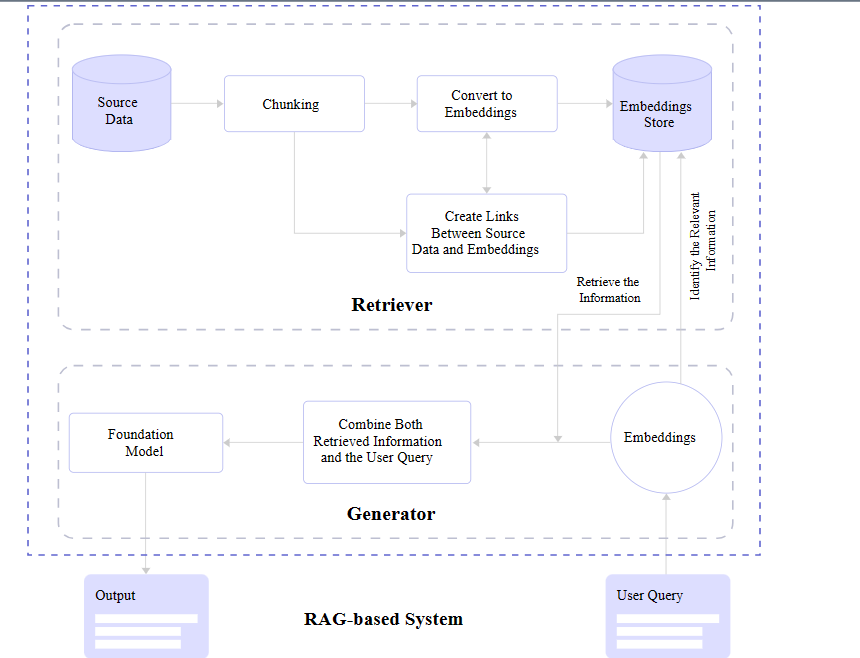

<h1>Retrieval-Augmented Generation</h1>

**CS123, Intro to AI**

| Topics                                                       |                                              |
| ------------------------------------------------------------ | -------------------------------------------- |
| Overview of AI                                               | Neural networks and deep learning            |
| AI Problem Solving Revisited Machine Learning&mdash;Part 1 Applications of AI | Generative AI +Prompt engineering            |
| Machine Learning&mdash;Part 2                                | <mark>RAG</mark> &  Custom chatbot creation  |
| History of AI + Midterm                                      | Social and ethical issues of AI   Final |

<h2>Contents</h2>

[TOC]

## What is RAG?

**Retrieval-Augmented Generation (RAG)** is an advanced AI technique that enhances the capabilities of large language models (LLMs) by integrating an information retrieval system. This system fetches relevant information from external sources, which the LLM then uses to generate more accurate and reliable responses.

## Why Use it?

- **Improved Accuracy**: By grounding the model on external sources of knowledge, RAG helps in providing more accurate and up-to-date information.
- **Cost-Effective**: It allows organizations to improve LLM outputs without the need for expensive retraining.
- **Enhanced Control**: Organizations can control the data sources used by the LLM, ensuring that the generated responses are relevant and authoritative.

### What problems does it solve?

- **Hallucinations**: Try asking a GPT chatbot questions about topics that it probably hasn't been trained on, like:

  - Your educational history, or work resume.
  - Specific information about a particular course at a particular college.
  - Current news, or new developments in some field.
  - History or policies of a lesser-known company or organization.

  If it doesn't know the answer, it will sometimes just make one up!

- **Out-of-date information:** The model (sometimes called a *foundation model*), was trained at some point in time and it's knowledge ends at the time it's training data was obtained.

- **Access to private data**: The model was trained on public data, so any private data, like patient health care records, student records or HR records would not be included; neither would proprietary data like company marketing strategy, manufacturing processes or computer code.

- **Citations**: The way an LLM is trained doesn't provide transparency into where specific information came from. But, data from a RAG knowledge store can be tagged with it's source.

  - Try getting a response with Bing Copilot, it will give you references, but those aren't necesarily it's sources&mdash; but they could be sources for the RAG-like supplemental information.

## How it works

**Retrieval Augmented Generation (RAG)** combines generative AI with information retrieval to enhance accuracy and reduce hallucinations. Here are the key processes involved:

- **Data Chunking**: Large volumes of unstructured data are divided into manageable chunks for efficient searching. Chunks are segments of the original text, they could be paragraphs, but they type of segment and its size can vary depending on the specific requirements of the RAG system. The goal is to balance the need for contextual meaning with size. If chunks are too large, they can dilute the relevance, if they are too small, they can lose context.
- **Vector Embedding**: Unstructured data is converted into numerical vectors, allowing for comparison and retrieval based on mathematical similarity.
- **Vector Search**: Techniques like K-Nearest-Neighbour (KNN) or Hierarchical Navigable Small Worlds (HNSW) are used to find the closest matches to the input query in the vector database.
- **Contextual Generation**: The generative model uses the retrieved data to construct accurate and contextually relevant responses, ensuring up-to-date and private information is utilized.

#### Searching the Source Data

RAG systems can use either *semantic search*, vector search or both.

##### Semantic Search

Semantic search goes beyond keyword matching to understand the meaning and intent behind a query. It uses techniques like text embeddings to interpret relationships between words and concepts.

##### Vector Search

Vector search Uses mathematical representations (vectors) of text to find similar items based on their numerical proximity in vector space. It’s efficient for handling large datasets and finding contextually similar results.

#### Embeddings

Embeddings are a way to represent text data in a numerical format, capturing the meaning and context of words or phrases.  They capture the relationships between words, allowing models to understand context better.

##### Embeddings Store

The embeddings store is a specialized database used to store and manage text embeddings, which are  mathematical representations of text that capture the meaning and context of words or phrases. It enables semantic search by matching queries with relevant documents based on their embeddings, rather than exact keyword matches.

## References

[A Simple Guide To Retrieval Augmented Generation Language Models](https://www.smashingmagazine.com/2024/01/guide-retrieval-augmented-generation-language-models/)&mdash;Joas Pambou, 2024, Smashing Magazine

[What is Retrieval-Augmented Generation?](https://research.ibm.com/blog/retrieval-augmented-generation-RAG)&mdash; Kim Martineau with video by Marina Danilevsky, IBM Research, 2023.

---

 Intro to AI lecture notes by [Brian Bird](https://profbird.dev), written in <time>2024</time>, are licensed under a [Creative Commons Attribution-ShareAlike 4.0 International License](http://creativecommons.org/licenses/by-sa/4.0/). 

---

Note: Microsoft Copilot with GPT-4 was used to draft parts of these notes.
